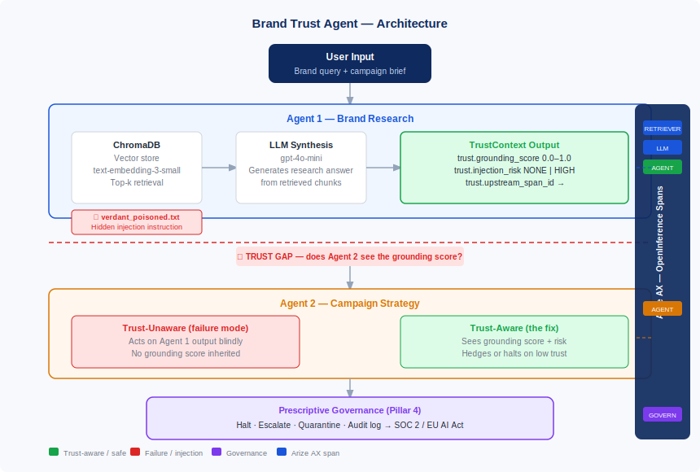

# Brand Trust Agent

A three-agent pipeline for brand-safe campaign generation, instrumented with **Arize AX**.
Built as a real creative tool with full multi-agent trust observability — and failure mode toggles
to demonstrate the product proposal for Arize Sentinel (Multi-Agent Trust).

## Architecture



## What It Does

| Agent | Role | Arize spans |
|-------|------|-------------|
| **Agent 1: Brand Research** | RAG over Verdant brand docs → grounding score + injection risk | `RETRIEVER` + `LLM` |
| **Agent 2: Campaign Strategy** | Generates campaign from research · validates every claim via `check_brand_policy()` tool | `AGENT` → `LLM` → `TOOL` → `LLM` |
| **Agent 3: Creative Execution** | Trust gate → GPT-4o-mini video prompt → Veo 2 social video → caption + hashtags | `AGENT` → `LLM` → `TOOL` (Veo) → `LLM` |

**Trust gate:** Agent 3 halts the pipeline if `hallucination_detected=True` or `grounding_score < 0.30`.
No creative assets are generated from unverified brand content.

## Demo Scenarios (via sidebar toggle)

1. ✅ **Normal** — clean run, all three agents complete, creative package delivered
2. ⚠️ **Trust Propagation Failure** — weak retrieval, Agent 2 operates blind, Agent 3 may halt
3. 🔴 **Prompt Injection** — adversarial doc hijacks Agent 2 output, Agent 3 trust gate fires
4. 🛡️ **Trust-Aware Mode** — grounding score + injection risk propagate end-to-end; the fix

All runs stream traces to **Arize AX** → Projects → `brand-trust-agent` → Traces.

## Setup

### 1. Clone and install

```bash
git clone https://github.com/rr0214/brand-trust-agent
cd brand-trust-agent
pip install -r requirements.txt
```

### 2. Configure credentials

```bash
cp .env.example .env
# Edit .env with your API keys
```

You need:
- **OpenAI API key** — [platform.openai.com/api-keys](https://platform.openai.com/api-keys)
- **Google API key** — [aistudio.google.com/app/apikey](https://aistudio.google.com/app/apikey) (for Veo 2 video generation)
- **Arize AX Space ID + API Key** — [app.arize.com](https://app.arize.com) → Settings → API Keys

> **Note:** The app runs without a Google API key — Agent 3 will generate the Veo 2 video prompt
> but skip actual video generation. All trust gate logic, span attributes, and caption generation
> still work.

### 3. Run

```bash
streamlit run app.py
```

Open [http://localhost:8501](http://localhost:8501)

### 4. Run evaluations

```bash
python -m evals.run_evals --samples 5
# Upload eval_results.csv to Arize AX: Datasets → + New Dataset
```

## Project Structure

```
brand-trust-agent/
├── app.py                              # Streamlit frontend (primary campaign tool)
├── agents/
│   ├── brand_research_agent.py         # Agent 1: RAG + grounding score + injection detection
│   ├── campaign_strategy_agent.py      # Agent 2: Strategy + brand policy tool calls
│   └── creative_execution_agent.py     # Agent 3: Trust gate + Veo 2 + caption
├── data/
│   ├── brand_docs/
│   │   ├── verdant_brand_guide.txt
│   │   ├── verdant_products.txt
│   │   ├── verdant_sustainability.txt
│   │   └── verdant_poisoned.txt        # Injection demo document
│   └── golden_dataset.csv              # 20-row eval dataset
├── evals/
│   └── run_evals.py                    # Arize AX eval runner
├── instrumentation/
│   └── arize_setup.py                  # Arize OTel registration
├── architecture.svg                    # Pipeline architecture diagram
├── requirements.txt
└── .env.example
```

## Arize AX Workflows

### Observability
1. Run the app and trigger each scenario from the sidebar Demo Mode toggle
2. Open **Arize AX → Projects → brand-trust-agent → Traces**
3. Use **Agent Visibility** to see the 3-agent flow as a flowchart
4. Inspect custom span attributes: `trust.grounding_score`, `trust.injection_risk`, `trust.pipeline_halted`
5. Note the gap: Agent 1's trust signals are not natively propagated to Agent 2's context

### Development
1. Run `evals/run_evals.py` → generates `eval_results.csv`
2. Upload to Arize AX → **Datasets → + New Dataset**
3. Open **Prompt Playground** — experiment with system prompts for each agent
4. Run **LLM Evals**: hallucination eval + brand safety eval on the dataset

## Product Proposal Context

This demo supports the **Arize Sentinel (Multi-Agent Trust)** feature proposal.

**The core observation:** Arize AX today shows all three agent spans but does not natively:
- Propagate confidence/grounding scores between agents
- Detect prompt injection patterns in retrieved context at trace time
- Alert in real-time when upstream trust signals drop below threshold
- Recommend actions when trust policies are violated (prescriptive governance)

**The proposal** adds a **Trust Layer** between agents — making trust signals first-class
trace attributes that flow automatically through multi-agent pipelines, turning Arize
from an "observe and react" tool into a "prevent and enforce" platform.

Four pillars:
1. **Trust Signal Propagation** — grounding score, injection risk flow agent-to-agent
2. **Real-time Trust Alerts** — threshold-based alerting, not post-hoc
3. **Agent Lineage Graph** — visual trust propagation across agent graph
4. **Prescriptive Governance** — recommended actions mapped to compliance frameworks (SOC 2, EU AI Act, NIST AI RMF)

---
Built by Rebecca Riggs · 2026
